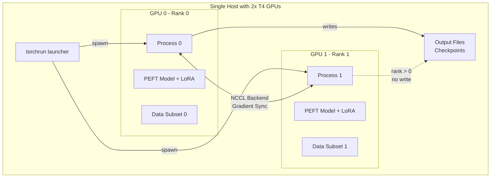

# Distributed Training with PEFT + DDP on 2x T4 GPUs

This document explains the multi-GPU distributed training setup for the Qwen3 model using PyTorch's DistributedDataParallel (DDP) with PEFT LoRA adapters.

## Overview

The implementation supports distributed training on 2x T4 GPUs using:
- **PyTorch DistributedDataParallel (DDP)** for efficient multi-GPU training
- **PEFT LoRA** for parameter-efficient fine-tuning
- **NCCL backend** for optimal NVIDIA GPU communication
- **DistributedSampler** for automatic data sharding across GPUs

## Architecture



## Key Features

### 1. PEFT + DDP Integration
- **Correct Order**: Base Model → LoRA Config → PEFT Model → DDP Wrapping
- **find_unused_parameters=False**: Only LoRA adapter weights are trainable
- **Gradient Clipping**: Applied before optimizer step for stability

### 2. Data Distribution
- **generate_data.py**: Questions divided evenly across GPUs
- **train_loop.py**: DistributedSampler automatically shards training data
- **Batch Size**: Per-GPU batch size remains constant, effective batch size doubles

### 3. Synchronization
- **Loss Averaging**: `dist.all_reduce()` averages losses across GPUs
- **Barrier Synchronization**: Ensures all processes reach checkpoints together
- **Model Saving**: Only rank 0 saves checkpoints to avoid conflicts

## Usage

### Quick Start

```bash
# Make launcher script executable
chmod +x run_distributed.sh

# Run both scripts on 2 GPUs
./run_distributed.sh
```

### Manual Execution

```bash
# Set environment variables
export MASTER_ADDR=localhost
export MASTER_PORT=29500
export WORLD_SIZE=2
export CUDA_VISIBLE_DEVICES=0,1

# Run data generation
torchrun --nproc_per_node=2 generate_data.py \
    --num_questions 88 \
    --batch_size 38 \
    --num_sequences_per_question 25

# Run training
torchrun --nproc_per_node=2 train_loop.py \
    --num_epochs 1000 \
    --batch_size 10 \
    --learning_rate 1e-4 \
    --r 32
```

## Technical Details

### Model Loading Process

```python
# 1. Load base model
model = AutoModelForCausalLM.from_pretrained(model_path)

# 2. Apply LoRA configuration
peft_config = LoraConfig(
    task_type=TaskType.CAUSAL_LM,
    r=32,  # LoRA rank
    target_modules=["q_proj", "v_proj", "k_proj", "o_proj"]
)

# 3. Create PEFT model
peft_model = get_peft_model(model, peft_config)

# 4. Wrap with DDP
peft_model = DDP(peft_model, device_ids=[local_rank], find_unused_parameters=False)
```

### Training Loop Modifications

- **DistributedSampler**: Automatically handles data sharding
- **Gradient Synchronization**: DDP handles gradient averaging automatically
- **Loss Reduction**: Uses `dist.all_reduce()` to average losses across GPUs
- **Validation**: All GPUs participate, but only rank 0 reports results

### Memory Optimization

- **find_unused_parameters=False**: Only syncs LoRA adapter gradients
- **Gradient Clipping**: Prevents gradient explosion with LoRA adapters
- **Model Saving**: Only rank 0 saves, reducing I/O overhead

## Performance Expectations

| Metric | Single GPU | 2x T4 GPUs | Speedup |
|--------|------------|------------|---------|
| Data Generation | 100% | ~50% | ~2.0x |
| Training Time | 100% | ~55-65% | ~1.5-1.8x |
| Memory per GPU | 100% | ~50% | 2x capacity |

*Note: Training speedup is less than 2x due to communication overhead*

## Troubleshooting

### Common Issues

1. **NCCL Errors**
   ```bash
   # Check CUDA availability
   nvidia-smi
   # Verify NCCL is available
   python -c "import torch; print(torch.cuda.nccl.version())"
   ```

2. **Process Group Initialization Fails**
   ```bash
   # Ensure unique port
   export MASTER_PORT=$((29500 + RANDOM % 1000))
   ```

3. **Memory Issues**
   - Reduce batch size per GPU
   - Enable gradient checkpointing
   - Use mixed precision training

### Debugging

Enable distributed debugging:
```bash
export TORCH_DISTRIBUTED_DEBUG=DETAIL
export TORCH_CPP_LOG_LEVEL=INFO
```

## File Structure

```
.
├── generate_data.py          # Modified for distributed data generation
├── train_loop.py            # Modified for distributed training
├── run_distributed.sh       # Launcher script
├── DISTRIBUTED_TRAINING.md  # This documentation
└── data/
    ├── traj_chat.jsonl      # Training data (rank 0 only)
    ├── traj_val.jsonl       # Validation data (rank 0 only)
    └── results/
        └── traj_chat/       # Model checkpoints (rank 0 only)
```

## Best Practices

1. **Always use torchrun**: Handles process spawning and environment setup
2. **Set deterministic seeds**: For reproducible results across runs
3. **Monitor GPU utilization**: Use `nvidia-smi` to check load balancing
4. **Test with small batches**: Before full training runs
5. **Use barriers**: For critical synchronization points

## References

- [PyTorch Distributed Training](https://pytorch.org/tutorials/intermediate/ddp_tutorial.html)
- [PEFT Documentation](https://huggingface.co/docs/peft)
- [DistributedDataParallel Best Practices](https://pytorch.org/docs/stable/notes/ddp.html)